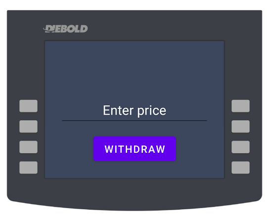

# Chain of Responsibility Example

this project example of **Chain of Responsibility** design pattern and implement of ATM device.

developed with **JAVA**

~~~ java

    private List<Money> createChain() {
        List<Money> chain = new ArrayList<>();

        Money one = new OneDollar(7, null, this);
        Money two = new TwoDollar(8, one, this);
        Money five = new FiveDollar(9, two, this);
        Money ten = new TenDollar(10, five, this);
        Money twenty = new TwentyDollar(11, ten, this);
        Money fifty = new FiftyDollar(12, twenty, this);
        Money oneHundred = new OneHundredDollar(13, fifty, this);

        chain.add(oneHundred);
        chain.add(fifty);
        chain.add(twenty);
        chain.add(ten);
        chain.add(five);
        chain.add(two);
        chain.add(one);

        return chain;
    }

~~~ 

## Screenshots

